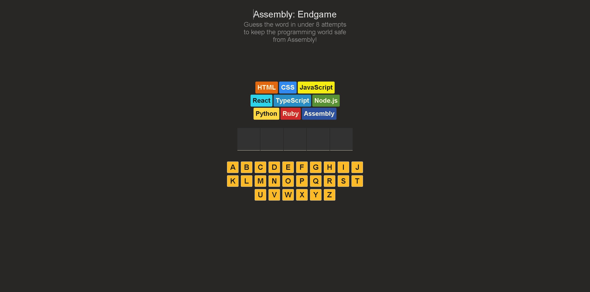

# Assembly Endgame 🎮

Assembly Endgame is a hangman-style word-guessing game with a unique twist. Instead of a man being hanged, the game uses programming languages as the stakes. Your goal is to guess the word before the only language left is Assembly, which is notoriously difficult to work with! 😱

## Features

- **Interactive Gameplay** 🎯: Guess the word by selecting letters. Each incorrect guess brings you closer to using Assembly.
- **Dynamic Feedback** 💭: Visual and textual feedback for correct and incorrect guesses.
- **Confetti Celebration** 🎉: Celebrate your victory with a burst of confetti.
- **Accessible Design** ♿: Screen reader support for an inclusive gaming experience.

## How It Works

1. **Start the Game** 🎲: A random word is selected from a predefined list.
2. **Make Guesses** 🤔: Click on letters to guess the word. Correct guesses reveal the letters in the word.
3. **Track Progress** 📊: Each incorrect guess changes the background to a different programming language.
4. **Win or Lose** 🏆: Guess the word before all languages are exhausted to win. If not, you'll be left with Assembly.

## Installation 🛠️

1. Clone the Repository:
   ```bash
   git clone https://github.com/yourusername/assembly-endgame.git
   cd assembly-endgame
   ```

2. Install Dependencies:
   ```bash
   npm install
   ```

3. Run the Development Server:
   ```bash
   npm run dev
   ```

4. Build for Production:
   ```bash
   npm run build
   ```

5. Preview the Production Build:
   ```bash
   npm run preview
   ```

## Technologies Used 💻

- **React**: For building the user interface.
- **TypeScript**: For type-safe JavaScript development.
- **SCSS**: For styling the application.
- **Vite**: For fast development and build tooling.
- **React Confetti**: For celebratory effects.

## Contributing 🤝

1. Fork the Repository: Click the "Fork" button at the top right of the repository page.

2. Clone Your Fork:
   ```bash
   git clone https://github.com/yourusername/assembly-endgame.git
   cd assembly-endgame
   ```

3. Create a Branch:
   ```bash
   git checkout -b feature/your-feature-name
   ```

4. Make Your Changes: Implement your feature or fix.

5. Commit Your Changes:
   ```bash
   git commit -m "feat: Add your feature"
   ```

6. Push to Your Fork:
   ```bash
   git push origin feature/your-feature-name
   ```

7. Create a Pull Request: Go to the original repository and click "New Pull Request".

## Screenshot/Preview 📸



[Click here to play!](https://donnyjb06.github.io/assembly-endgame/)


---

Feel free to customize the sections as needed, especially the repository URLs and any additional features or technologies specific to your project. 👋
